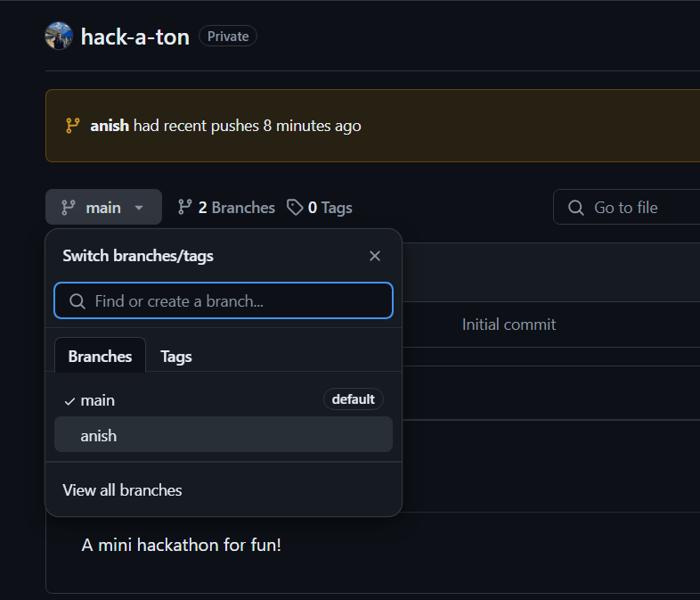
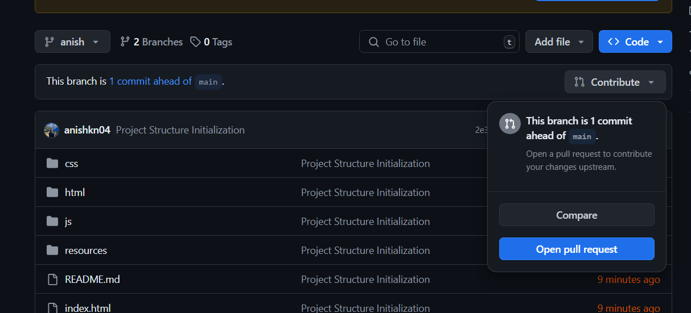
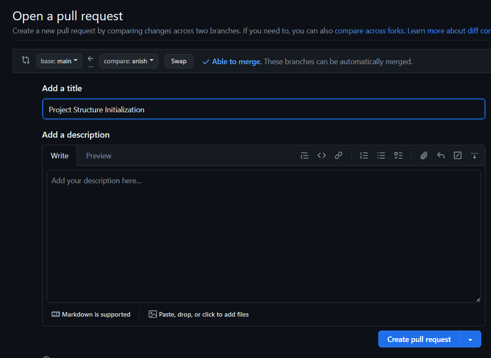

# Contribution Guide

<h3> Note: If you have already created your branch once, the next time you work on the same branch do not forget to do the following: 

1. Switch branch to yours  
2. <code>git fetch origin
 
git merge main</code> 

 Now you can start working again

Also, if the branch already exists, the third point in Step 3 will be simply "git push"
</h3>

# Get Started

1. Clone: `git clone https://github.com/anishkn04/hack-a-ton.git`

2. Checkout to your branch: `git checkout -b yourName` (Use your name for the branch name, example: anish, nishan, etc)

3. Make your changes and do:
    - `git add . (or your specific file/folder name instead of .)`
    - `git commit -m "Short message of what you did"`
    - `git push --set-upstream origin yourBranchName` 
    (This is for the first time if there is no branch in the upstream) 
    (If you work on the same branch next time, you can just do `git push`)

4. Then go to repo: https://github.com/anishkn04/hack-a-ton, select your branch.

5. Select Contribute ->  Open Pull Request

6. Add title and Description as needed and Create Pull Request

7. You can commit more changes while you wait for PR to be merged!